# Automatic-License-Plate-Recognition
ALPR using Tensorflow API and Pytesseract (OCR) Module
The project developed using TensorFlow to detect the License Plate from a car and uses the Tesseract Engine to recognize the charactes from the detected plate.

The Dataset used for training is https://cc-uploads.s3.amazonaws.com/open_links/HumAIn+2019/vehicle-number-plate-detection+Datasets.zip

ALPR(1).ipynb and ALPR(2).ipynb File Contains the implementation Of the Project 

FASTER RCNN INVEPTION V2 Model is used to train the images . The Accuracy of the Model is 99% and the loss is less then 0.05.

OPENCV is used for preprocessing the images

Pytesseract (Google's Tesseract-OCR Engine) is used for optical Character Recognition.

Here are few Examples of License Plate Recognition and Detection:

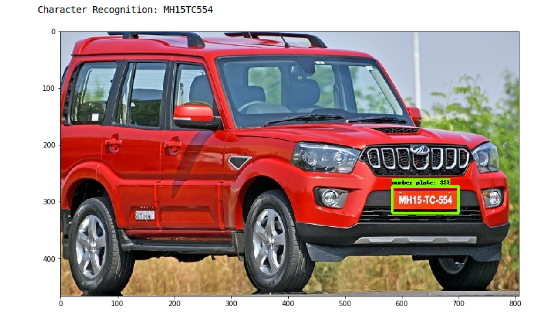

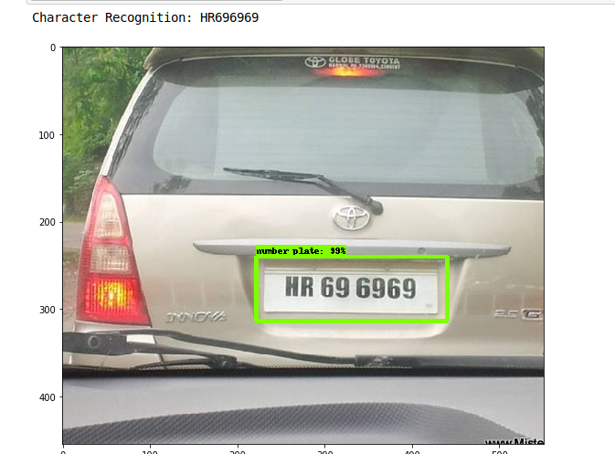

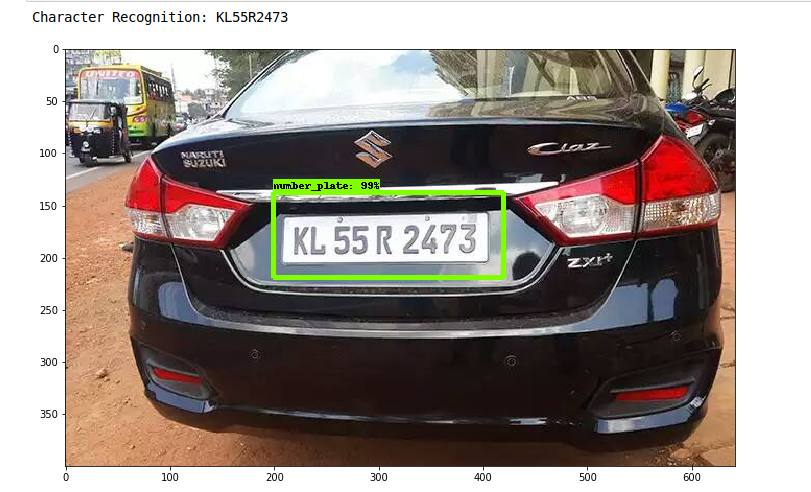

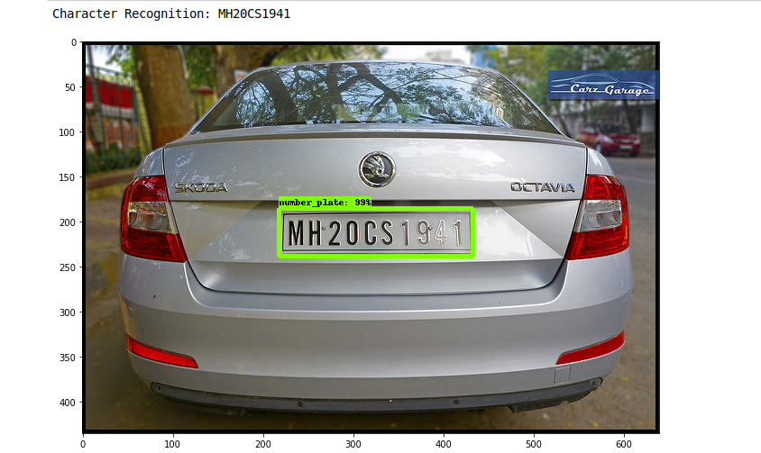

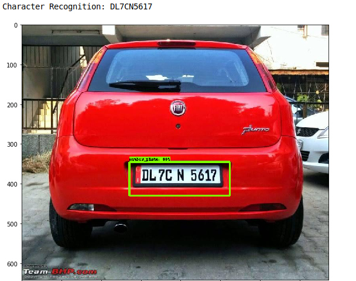

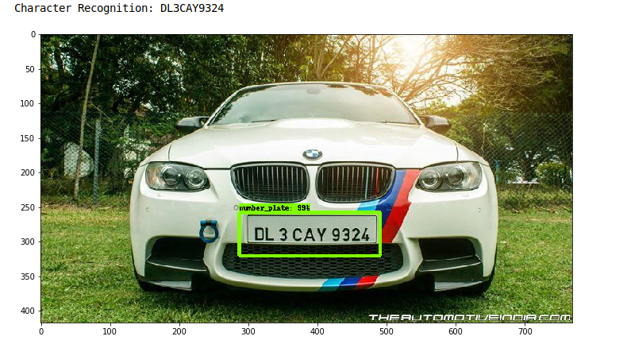

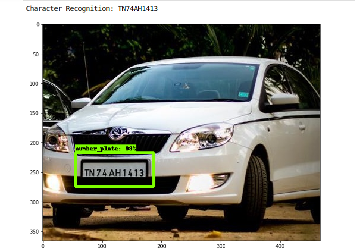

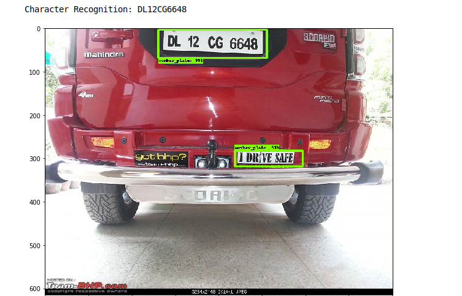

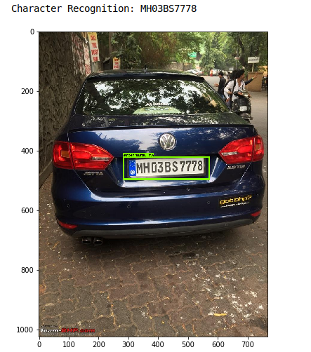

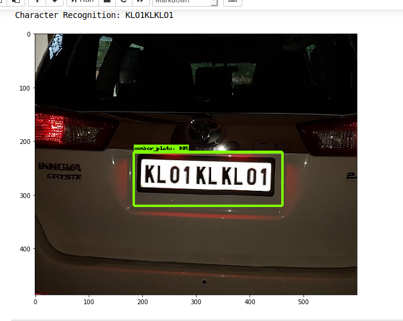

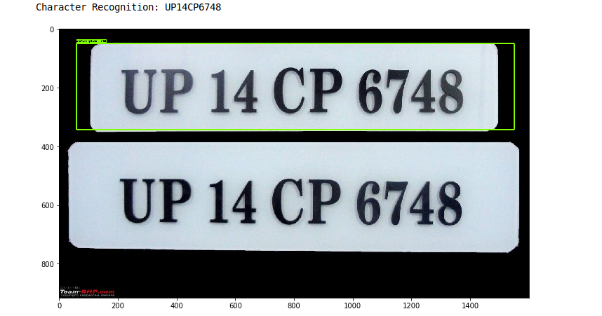

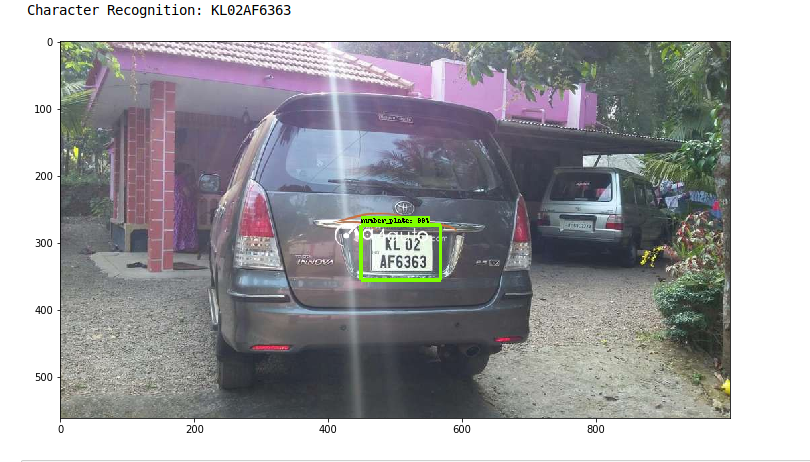

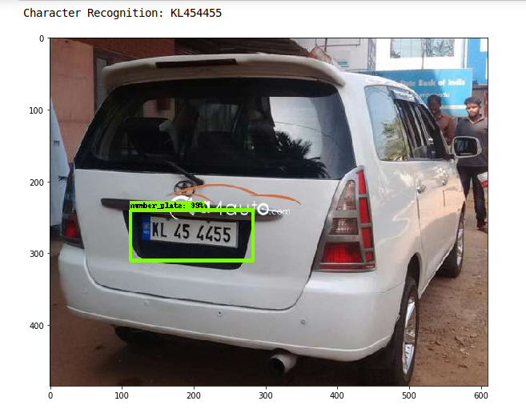

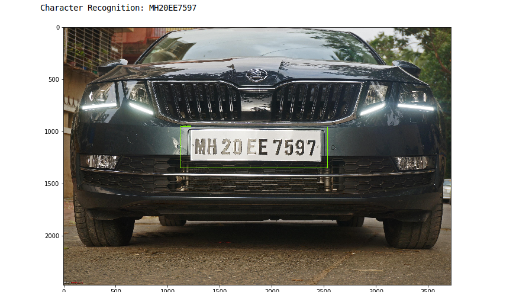

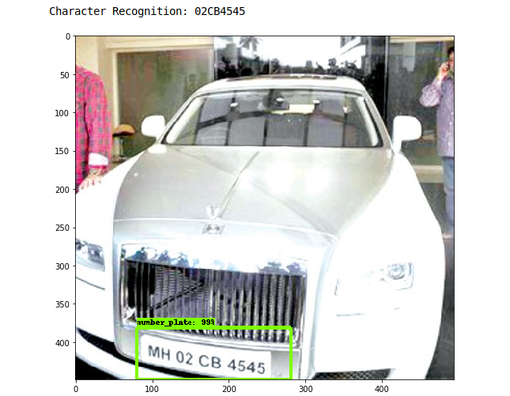

Loss Graph
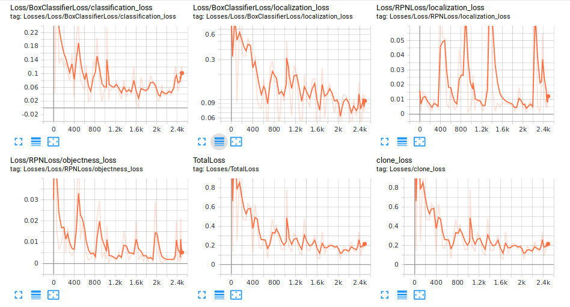
